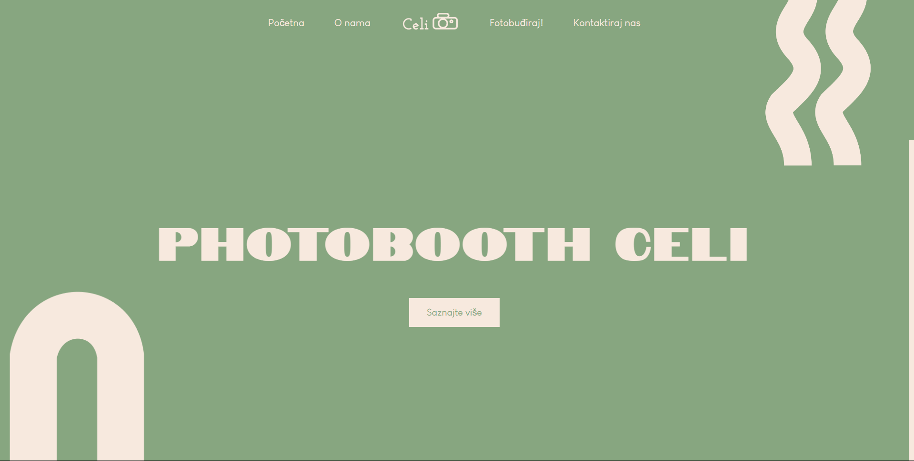

# Photobooth Celi

Photobooth Celi is a web-based application that uses HTML, CSS, JavaScript, and TensorFlow.js to create an interactive photobooth experience. The application leverages AI to recognize a person in the camera feed and replace the background with a different image. It is designed to be fun and easy to use.

## Deadline

The project deadline is May 3, 2024.

## Features

- **Real-time Person Detection**: Uses TensorFlow.js to detect a person in the webcam.
- **Background Replacement**: Automatically replaces the background behind the detected person with a specific image.
- **Customizable Backgrounds**: Users can select from a variety of backgrounds.
- **User-Friendly Interface**: Simple interface for all users.

## Contact

For questions and feedback please reach out to:

- Marina Žižić
- Email: marinazizicc@gmail.com
- GitHub: [marinazizic](https://github.com/marinazizic)
